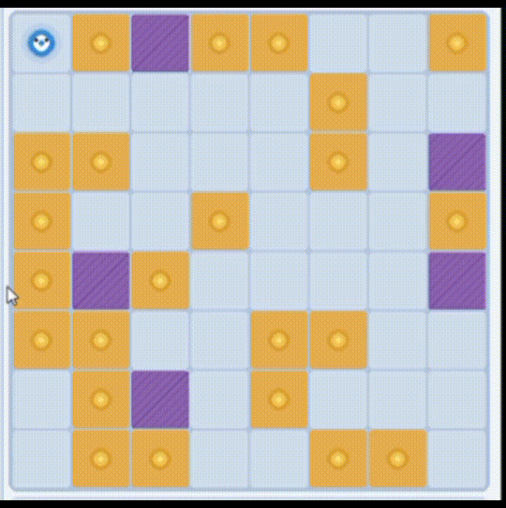
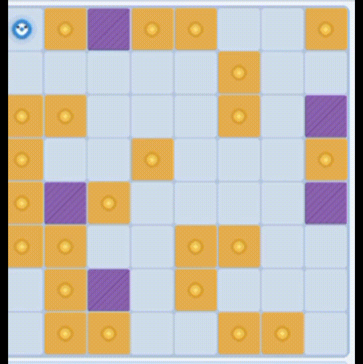
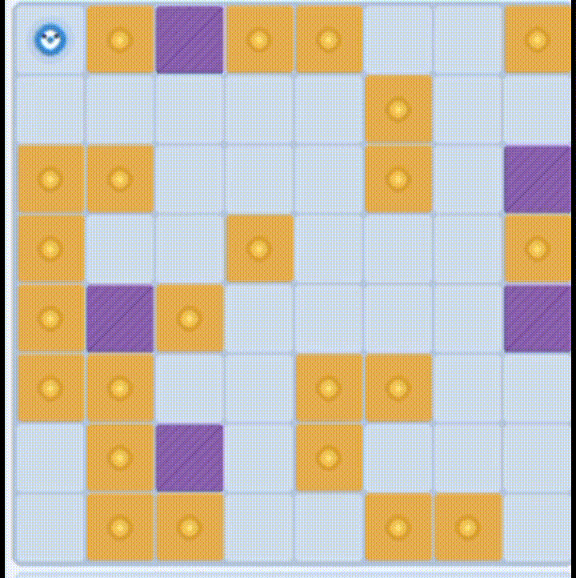
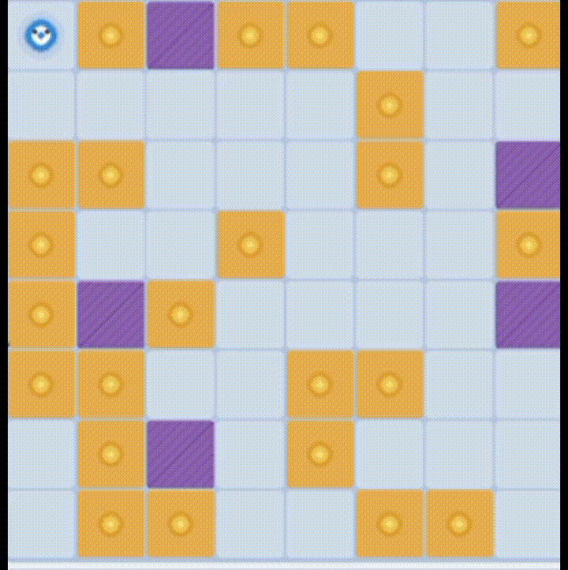
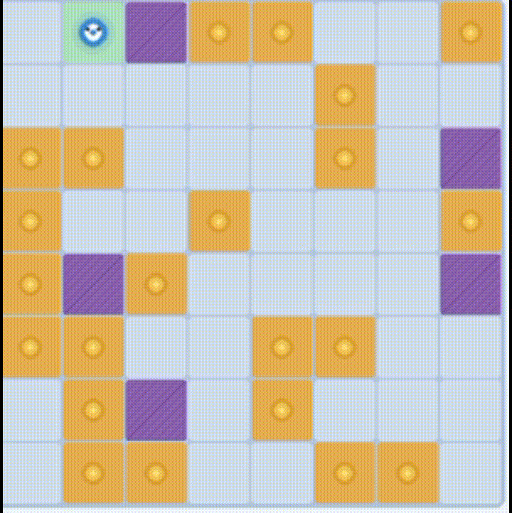

# 🤖 Vacuum Cleaner AI — Mô phỏng Robot Hút Bụi Thông Minh

VacuumAI là dự án mô phỏng robot hút bụi tự động sử dụng các thuật toán tìm kiếm trong Trí tuệ Nhân tạo như BFS, DFS, IDS, UCS, Greedy Best-First Search và A\*.

---

## 📋 Mục lục

1. [Tổng quan](#tổng-quan)
2. [Tính năng](#tính-năng)
3. [Công nghệ sử dụng](#công-nghệ-sử-dụng)
4. [Cách hoạt động](#cách-hoạt-động)
5. [Các thuật toán](#các-thuật-toán)
6. [Bắt đầu sử dụng](#bắt-đầu-sử-dụng)
7. [Hướng dẫn chơi](#hướng-dẫn-chơi)
8. [Tác giả](#tác-giả)

---

## Tổng quan

Robot hút bụi là một bài toán kinh điển trong Trí tuệ Nhân tạo. Dự án này mô phỏng một robot tự động di chuyển trên lưới ô vuông, tìm kiếm và hút sạch các ô bụi bằng cách áp dụng các thuật toán tìm đường khác nhau. Người dùng có thể:

- Quan sát robot tự động giải bài toán theo từng bước.
- So sánh hiệu quả của các thuật toán AI trên cùng một bản đồ.
- Tự thiết kế bản đồ bằng cách vẽ tường, đặt bụi và đặt vị trí robot.

---

## Tính năng

- **Giao diện trực quan:** Lưới 8×8 hiển thị rõ ràng vị trí robot, bụi, tường và đường đi dự kiến.
- **8 thuật toán AI:** BFS1, BFS2, DFS1, DFS2, IDS, UCS, Greedy, A\*.
- **Chỉnh sửa bản đồ:** Vẽ tường, đặt bụi, đặt robot tự do bằng chuột.
- **Tạo bản đồ ngẫu nhiên:** Sinh bản đồ mới với tường và bụi phân bố ngẫu nhiên.
- **Điều chỉnh tốc độ:** Thanh slider từ chậm đến nhanh theo thời gian thực.
- **Thống kê trực tiếp:** Số bước di chuyển, số ô đã hút, số bụi còn lại.
- **Nhật ký hoạt động:** Log hiển thị toàn bộ hành trình của robot.

---

## Công nghệ sử dụng

- Python 3.8+
- Pygame

---

## Cách hoạt động

1. **Biểu diễn bản đồ:** Lưới 8×8 lưu trạng thái từng ô: trống (`EMPTY`), bụi (`DIRTY`), hoặc tường (`WALL`).
2. **Quản lý trạng thái:** Theo dõi vị trí robot, danh sách ô bụi, trail đã đi qua và cập nhật sau mỗi bước.
3. **Thực thi thuật toán:** Tại mỗi bước, robot gọi thuật toán được chọn để tìm đường đến ô bụi gần nhất, sau đó di chuyển theo path đó và hút sạch ô đích.

---

## Các thuật toán

| Thuật toán | Tối ưu | Bộ nhớ | Mô tả |
|---|:---:|---|---|
| **BFS 1** | ✅ | O(b^d) | Duyệt theo từng lớp, đánh dấu khi thêm vào frontier |
| **BFS 2** | ✅ | O(b^d) | Duyệt theo từng lớp, kiểm tra goal khi pop |
| **DFS 1** | ❌ | O(b·m) | Duyệt sâu dùng stack, đánh dấu khi push |
| **DFS 2** | ❌ | O(b·m) | Duyệt sâu dùng stack, kiểm tra goal khi pop |
| **IDS** | ✅ | O(b·d) | DFS lặp tăng dần độ sâu, tiết kiệm bộ nhớ như DFS nhưng tối ưu như BFS |
| **UCS** | ✅ | O(b^d) | Ưu tiên mở rộng node có chi phí g(n) thấp nhất |
| **Greedy** | ❌ | O(b^m) | Luôn đi theo hướng có heuristic h(n) nhỏ nhất, nhanh nhưng không đảm bảo tối ưu |
| **A\*** | ✅ | O(b^d) | Kết hợp g(n) + h(n), vừa tối ưu vừa hiệu quả nhất |

> **Heuristic sử dụng:** Khoảng cách Manhattan `|Δrow| + |Δcol|` — phù hợp cho lưới di chuyển 4 hướng.

---

## Bắt đầu sử dụng

**Clone repository:**

```bash
git clone https://github.com/<your-username>/vacuum-cleaner-ai.git
cd vacuum-cleaner-ai
```

**Cài đặt thư viện:**

```bash
pip install pygame
```

**Chạy chương trình:**

```bash
python vacuum_cleaner.py
```

---

## Hướng dẫn chơi

### Chọn thuật toán
Nhấn một trong 8 nút thuật toán ở panel bên trái. Nút đang chọn sẽ sáng lên.

### Điều khiển mô phỏng

| Nút | Chức năng |
|---|---|
| ▶️ **Start** | Bắt đầu / tiếp tục chạy |
| ⏹️ **Stop** | Tạm dừng |
| 🔄 **Reset** | Khôi phục bản đồ về trạng thái ban đầu |
| 🎲 **Random** | Tạo bản đồ ngẫu nhiên mới |

### Chỉnh sửa bản đồ *(chỉ khi không chạy)*

| Nút | Chức năng |
|---|---|
| 🧱 **Wall painting** | Click hoặc kéo chuột để vẽ tường |
| ✨ **Dust painting** | Click hoặc kéo chuột để đặt bụi |
| 🤖 **Place Robot** | Click để đặt vị trí xuất phát của robot |

> Click vào ô đang có để xóa (chế độ toggle).

### Ý nghĩa màu sắc trên lưới

| Màu | Ý nghĩa |
|---|---|
| 🔵 Xanh nhạt | Ô trống |
| 🟣 Tím | Tường — không thể đi qua |
| 🟡 Vàng | Bụi cần hút |
| 🟢 Xanh lá | Ô đã được hút sạch |
| 🔵 Chấm xanh | Đường đi dự kiến của robot |

### Phím tắt

| Phím | Chức năng |
|---|---|
| `Space` | Bắt đầu / Tạm dừng |
| `Esc` | Thoát chương trình |

---

## Giao diện

| A* | BFS |
|:---:|:---:|
|  |  |

| DFS | Greedy |
|:---:|:---:|
|  |  |

| IDS | UCS |
|:---:|:---:|
|  |  |

## Tác giả

Bài tập môn **Trí tuệ Nhân tạo**

- **[Huỳnh Hồng Thủy]** — [https://github.com/UTESnake](#)


